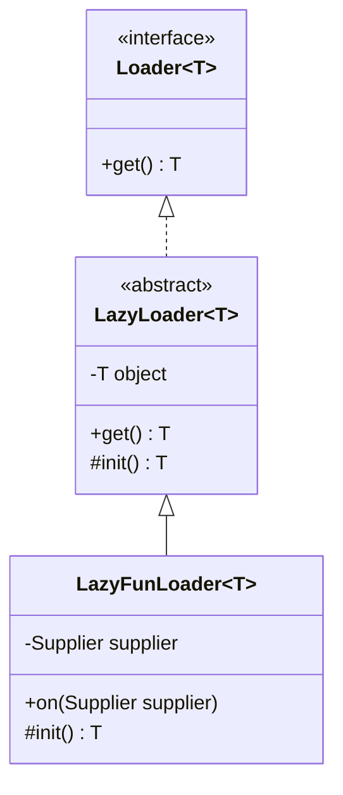

# 代码鉴赏：【Hutool工具】LazyLoader范型懒汉式单例

## :airplane: 背景

### 理论

单例模式有饿汉式和懒汉式，如果对象比较大会又不一定被使用，为了减少资源占用问题，一般会选择懒汉式模式，也就是使用时再加载

实现方式一般是`双重检测 + synchronized + volatile`，使用`volatile` 是防止指令重排序

### 痛点

理论清楚了，但是我们每次想要使用懒汉式单例都要重复实现一遍这些功能吗？

有没有一种工具是开箱即用，不用重复这些代码？

Hutool 工具 LazyLoader 实现了此功能

## :beach_umbrella: 功能

### 使用
```java
public class MainTest {

    // 懒汉式单例
    static LazyFunLoader<BigObject> loader = LazyFunLoader.on(BigObject::new);

    public static void main(String[] args) {
        // 首次调用实例化
        BigObject bigObject = loader.get();
        bigObject.setBigStr("test");
        System.out.println(bigObject.getBigStr());
        // 重复调用，不必实例化
        System.out.println(loader.get().getBigStr());
    }

    // 大对象
    static class BigObject {

        private String bigStr;

        public String getBigStr() {
            return bigStr;
        }

        public void setBigStr(String bigStr) {
            this.bigStr = bigStr;
        }

    }

}
```

> 使用很简单，这里就不讲解怎么使用了

### 便捷性

1. 开箱即用，不必要重复实现懒汉式代码
2. 只需定义要加载和对象和实现实例化的方法

## :fire: 分析

### 类结构



#### 三个类功能

1. 接口类`Loader`，定义`get()`获得对象接口

2. 抽象类`LoazyLoader`，实现`get()`接口，双重检测机制，并把实例化方法`init()`抛给上层去实现

   ```java
   public abstract class LazyLoader<T> implements Loader<T>{
   
     // 被加载对象
   	private volatile T object;
     
   	// 获取一个对象，第一次调用此方法时初始化对象然后返回，之后调用此方法直接返回原对象
   	@Override
   	public T get() {
   		T result = object;
   		if (result == null) {
   			synchronized (this) {
   				result = object;
   				if (result == null) {
   					object = result = init();
   				}
   			}
   		}
   		return result;
   	}
   
   	// 如果对象从未被加载过，调用此方法初始化加载对象，此方法只被调用一次
   	protected abstract T init();
   }
   ```

3. 函数式懒加载类`LazyFunLoader`，实现`init()`，改造为函数式，通过构造函数或`on`传递实现好的函数式接口

   ```java
   public class LazyFunLoader<T> extends LazyLoader<T> {
   
    	//用于生成对象的函数
   	private Supplier<T> supplier;
   
   	// 静态工厂方法，提供语义性与编码便利性
   	public static <T> LazyFunLoader<T> on(final Supplier<T> supplier) {
   		Assert.notNull(supplier, "supplier must be not null!");
   		return new LazyFunLoader<>(supplier);
   	}
   
   
   	public LazyFunLoader(Supplier<T> supplier) {
   		Assert.notNull(supplier);
   		this.supplier = supplier;
   	}
   
   	@Override
   	protected T init() {
   		T t = this.supplier.get();
   		this.supplier = null;
   		return t;
   	}
   
   }
   
   ```


## :beer: 结论

### :grinning: 亮点

1. 在抽象类里使用模版模式，定义好懒汉式实现方式骨架，自定义部分抛给上层实现，满足了开闭原则
2. 使用范型，可以适配所有类型的对象，避免重复代码


### 个人建议

可以去掉`LazyFunLoader`类，将函数式相关功能写在 `LazyLoader`类，然后去掉`abstract`关键字。层级看起来要简洁点，当然了，加上`LazyFunLoader`类后面可以扩展更多功能


### 参考代码

https://github.com/dromara/hutool/tree/v5-master/hutool-core/src/main/java/cn/hutool/core/lang/loader
