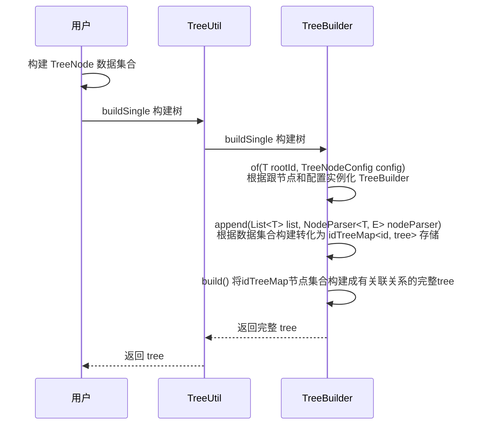

# 代码鉴赏：【Hutool工具】Tree结构设计


## :beach_umbrella: 功能

### 使用

```json
public class TreeTest {

	// 模拟数据
	static List<TreeNode<String>> nodeList = CollUtil.newArrayList();

	static {
		// 模拟数据
    // 参数 1: id 2:parentId 3:名称 4:权重（用于排序）
		nodeList.add(new TreeNode<>("1", "0", "系统管理", 1));
		nodeList.add(new TreeNode<>("111", "11", "用户添加", 0));
		nodeList.add(new TreeNode<>("11", "1", "用户管理", 222222));

		nodeList.add(new TreeNode<>("2", "0", "店铺管理", 2));
		nodeList.add(new TreeNode<>("21", "2", "商品管理", 44));
		nodeList.add(new TreeNode<>("221", "2", "商品管理2", 2));
	}

	@Test
	public void Test() {
    // 构建树结构
		List<Tree<String>> treeList = TreeUtil.build(nodeList, "0");
		treeList.forEach(item -> System.out.println(item.toString()));
	}

}


```
**输出结果**

```text

系统管理[1]
  用户管理[11]
    用户添加[111]

店铺管理[2]
  商品管理2[221]
  商品管理[21]
```


### 解释

1. 用户准备每个节点的 id，parentId 和 weight，用于构建逻辑树
2. 再调用 TreeUtil.build 构建树，传入节点数据和根节点


### 思考

作者的设计使用起来很方便，是个通用的树增删改查的工具，如果是你怎么设计呢？

下面我们来欣赏下作者是如何设计的，能给我们带来什么启发


## :fire: 分析

### 类结构

> 类结构比较简单，我就不画图了，简单描述

1. TreeUtil：工具类，面向用户，也就是说用户不需要知道具体细节，想要什么功能直接通过工具类去获取
2. TreeBuilder：树构建类，用于构建树结构
3. Tree：树类，存储当前树节点和孩子节点，也可以追述到父节点。该类并非通过写死字段实现，而是通过 `LinkedHashMap` 去存储相关字段，可以动态扩展和名称自定义
4. TreeNode：树节点数据，可对应数据库记录
5. TreeNodeConfig：树相关配置，主要用于应对不同场景的属性名，例如有些系统id名称可能是另外的名字rid，可通过这个配置进行修改
6. DefaultNodeParser：节点转化为树解析，可以应对复杂的场景，对外扩展，用户可修改

### 时序图




### :grinning: 亮点

#### 1、层次清晰

1. `TreeUtil`：对外用户提供工具，用户不需要了解实现细节，只知道里面有哪些功能即可
2. `TreeBuilder`：树的添加构建过程交由完成
3. `TreeNodeConfig`和`DefaultNodeParser`：对外有动态扩展配置

#### 2、存储结构

`Tree`：继承`LinkedHashMap`，用于存储当前节点和子节点，很新颖的存储思路，没有定义专门的字段去存储，可以更加动态扩展和修改

#### 3、构建方式

通过`TreeBuilder`去构建，其中可借鉴的结构方法

1. `of`根据参数生成对象，相当于构造函数
2. `append`增加相关节点
3. `build`最后根据某些逻辑规则构建成最终的树返回给用户


## :beer: 结论

1. 好的代码需要层次清晰，用户使用越简洁越好，尽量少知道细节，`util`统一对外工具是不错的思路
2. 提供可配置可扩展点，需要符合开闭原则，不能来一个功能又改一下核心代码，`TreeNodeConfig`和`DefaultNodeParser`的配置和扩展方式是不错的思路
3. 实现也需要逻辑分明，先有什么后有什么，不能一锅粥都写在一个方法里`TreeBuilder`构建方式是不错的思路


### 参考代码

https://github.com/dromara/hutool/tree/v5-master/hutool-core/src/main/java/cn/hutool/core/lang/tree
